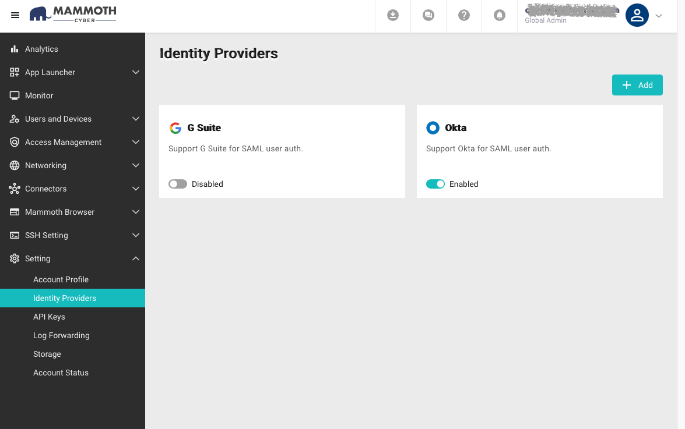
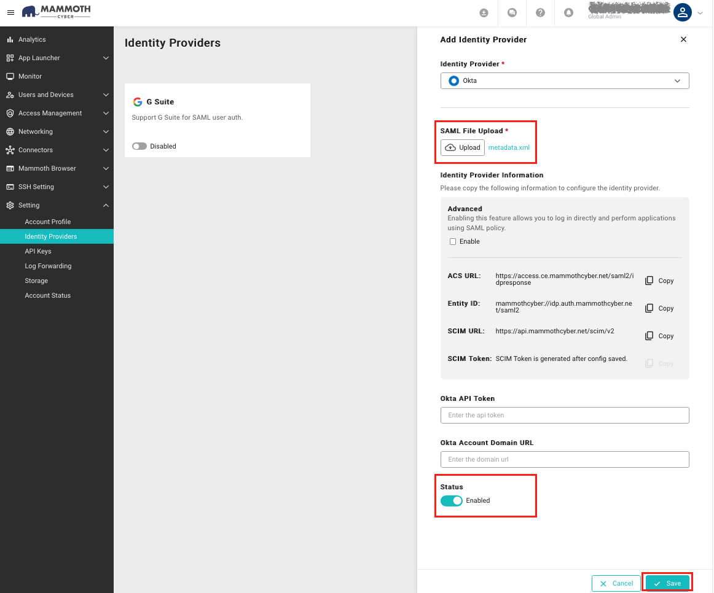

Configure SAML SSO with Okta
=========================================

Configuring your Okta tenant as an IDP to log in to **Mammoth Browser** involves the content below.

Requirements
------------

Before you configure Okta identity provider, make sure you have set up a custom domain.

Step­-by­-Step Configuration Instructions
-----------------------------------------

1\. In the Admin Console, go to **Setting > Account Profile.**

2\. Setting up a custom domain in "Tenant Domain URL" is required. Please follow the instructions [Portal Domain Customization](#).

3\. Click **\+ IdP** button.

4\. On the **Identity Provider Details page**, select Okta as the Identity Provider.

5. Open another browser tab and log in Okta.

6\. Go to **Applications > Applications**, click **Create App Integration**

7\. In the **Create a new app integration** pop-up window, choose **SAML 2.0**, then click **Next**

8\. General Settings: Enter the **App name**, upload the **App logo**, and check the **App visibility**. Click **Next** when you finish.

  
9\. Before you configure SAML, please go to the **Mammoth Browser** Identity Provider Detail page to copy the information you need.

10. Configure SAML: 

*   Copy **ACS URL** and paste it into the **Single sign on URL** field.
*   Copy the **Entity ID** and paste it into the **Audience URI (SP Entity ID)** field.
*   Name ID format: Select **EmailAddress**
*   Application username: Select **Okta username**
*   Attribute Statements (Optional)
    *   Enter "email" and select the name format as **Basic**.
    *   Enter "user.email" in the **Value** field.
*   Group Attribute Statements (Optional)
    *   Enter "groups" and select the name format as **Unspecified**
    *   Select **Matches regex** and enter ".\*"
*   Click "Next"

11. Choose your role to Okta, then click **Finish**.

12\. Download the IdP metadata file and upload it to **Mammoth Browser**.

*   Scroll down and you will see the **Metadata URL**, copy the URL to a new browser tab, it should show the metadata document.
*   Save the metadata document (select the page source if your browser has such option) to your disk and take note of the file name.

13. Back to the **Mammoth Browser** and upload the metadata file.

*   Tick the checkbox of "Enabled" in the Status.
*   Click "Save"

14. You have successfully added the Okta IdP.

15\. Assign the Okta IdP to the users who need to access applications from **Mammoth Browser**, to make them able to use their Okta account to log in to **Mammoth Browser**.

*   On the Okta, go to **Applications> Applications > Assignments**
*   Click **Assign > Assign to People**

*   Click **Assign** to the account, then click **Done**.

*   Enter the User Name, click **Save and Go Back**

16. Now you can use your Okta account to log in **Mammoth Browser**.

17. **You can configure the [OKTA SCIM](./SCIM-config-guide.md) to complete the entire IdP setup.**