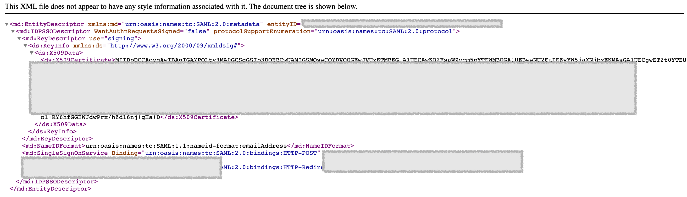

Configure SAML SSO with Okta
=========================================

Configuring your Okta tenant as an IDP to log in to **Mammoth Browser** involves the content below.

Requirements
------------

Before you configure Okta identity provider, follow the guide below to set up a custom **sub-domain**.

Step­-by­-Step Configuration Instructions
-----------------------------------------

1\. In the Admin Console, go to **Setting > Account Profile.**

2\. Setting up a custom sub-domain in "Tenant Domain URL" is required. Please follow the instructions [Portal Domain Customization](#).

3\. Go to **Setting > Identity Providers** Click **\+Add** button.

4\. On the **Identity Provider Details page**, select **Okta** as the Identity Provider.

5. Open another browser tab and log in Okta.

6\. Go to **Applications > Applications**, click **Browse App Catalog**

7\. In the **Browse App Integration Catalog** page, search for **Mammoth Enterprise Access Browser**, then select it from the list, then click the **Add Integration** button.

8\. General Settings: Customize the **Application label** and the **App visibility** settings. Click **Done** when you finish.

  
9\. Before you configure SAML, please go to the **Mammoth Browser** Identity Provider Detail page to copy the information you need.

10. Continue on the newly added app on Okta:

*   Edit the "SAML 2.0" in "Sign On" option.
*   Copy the **ACS URL** value from Mammoth IDP page to the Okta app setting.
*   Copy the **Entity ID** value from Mammoth IDP page to the Okta app setting.
*   Click "Save"

11\. Download the IdP metadata file and upload it to **Mammoth Browser**.

*   On the same page, under "SAML 2.0", you should see the **Metadata URL**, copy the URL to a new browser tab, it should show the metadata document.
*   Save the metadata document (select the page source if your browser has such option) to your disk and take note of the file name.

12. Back to the **Mammoth Browser**

*   Upload the metadata file.
*   Tick the checkbox of "Enabled" in the Status.
*   Click "Save"

13. You have successfully added the Okta IdP.

14\. Assign the Okta IdP to the users who need to access applications from **Mammoth Browser**, to make them able to use their Okta account to log in to **Mammoth Browser**.

*   On the Okta, go to **Applications> Applications > Assignments**
*   Click **Assign > Assign to People**

*   Click **Assign** to the account, then click **Done**.

*   Enter the User Name, click **Save and Go Back**

15. Now you can use your Okta account to log in **Mammoth Browser**.

16. **You can configure the [OKTA SCIM](./SCIM-config-guide.md) to complete the entire IdP setup.**