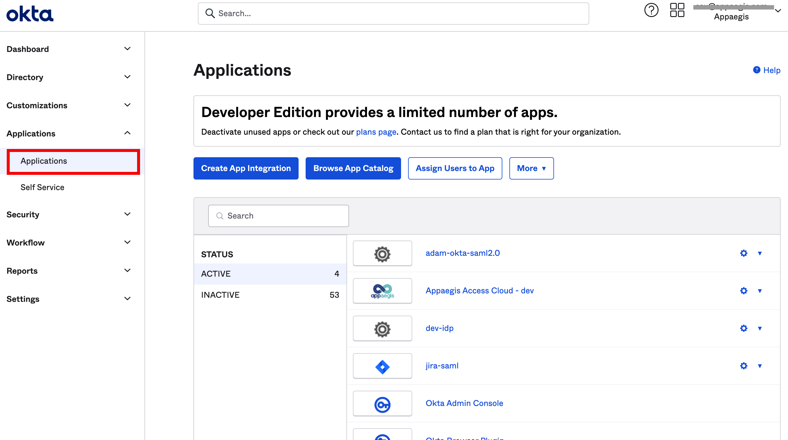
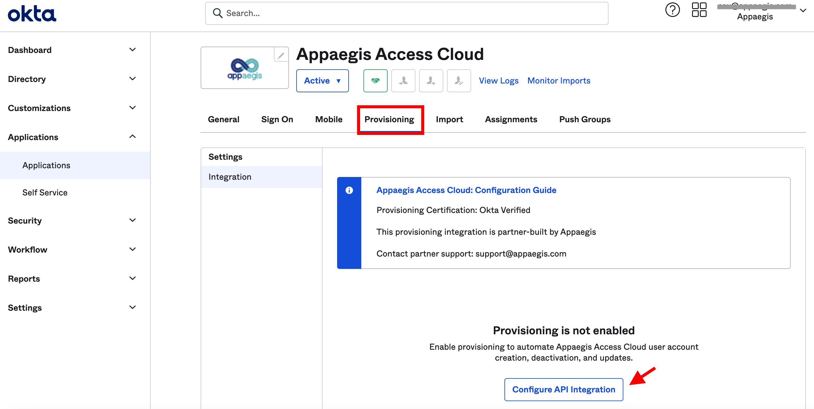
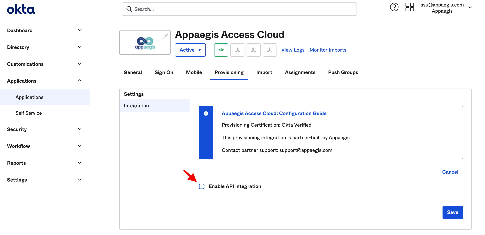
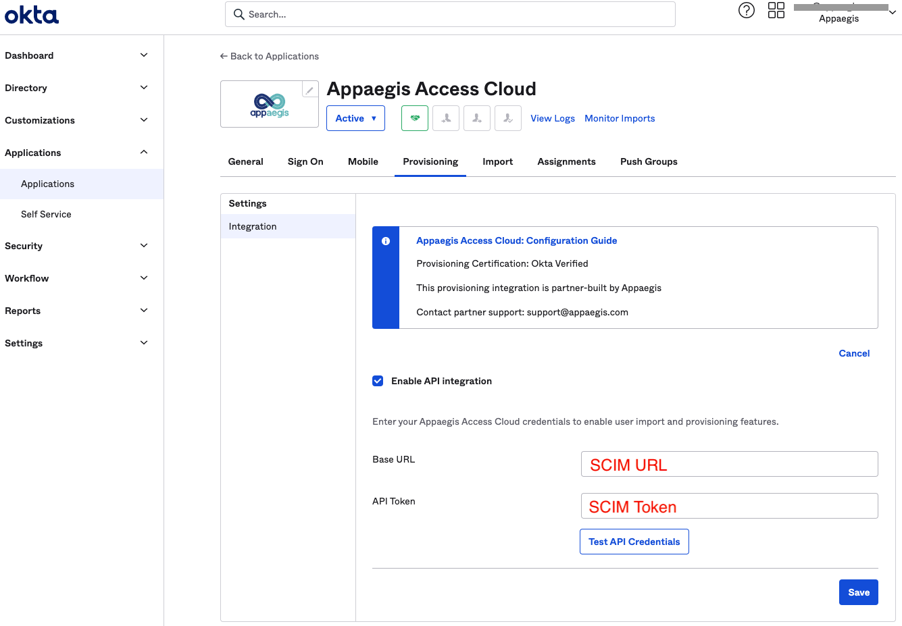
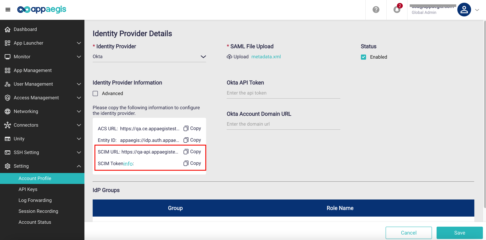
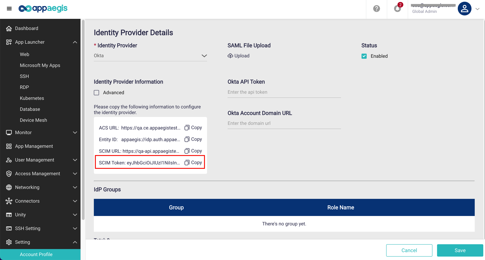
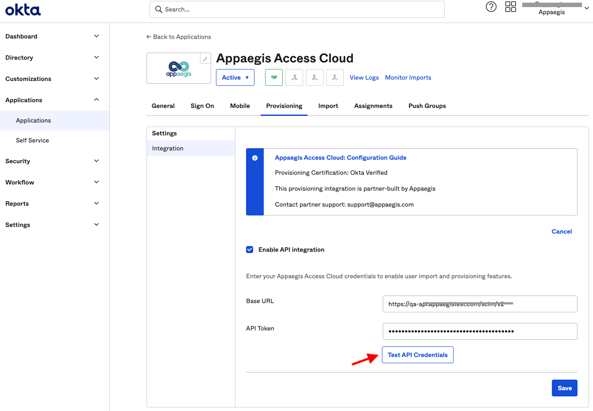
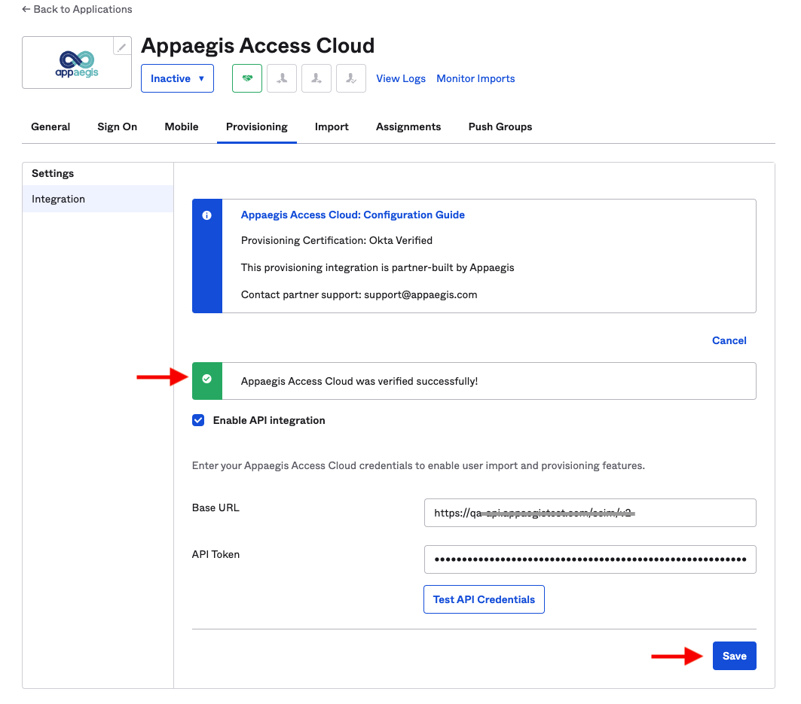
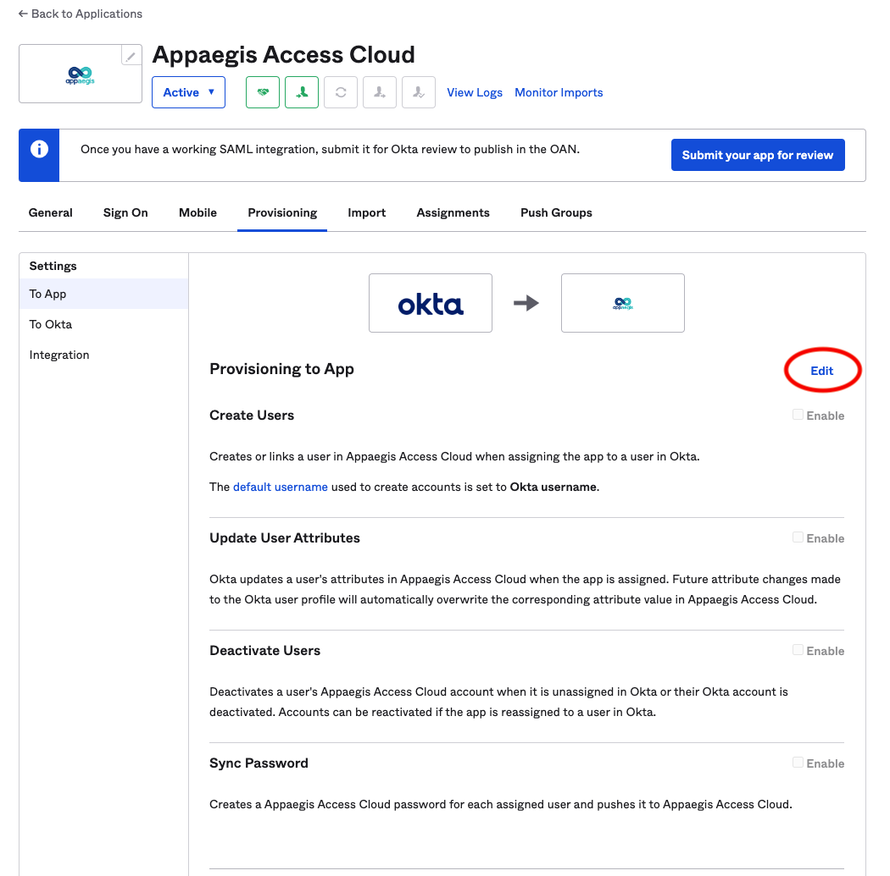
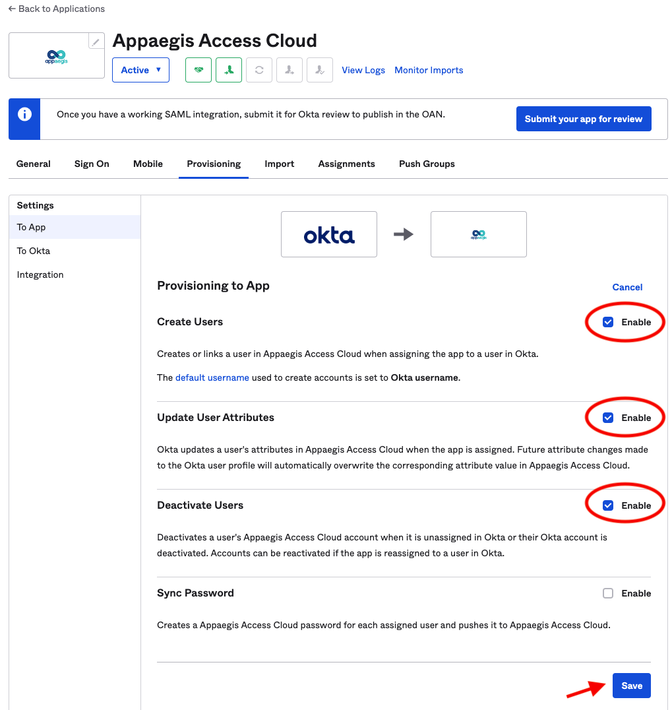

 Configure\_Okta\_SCIM\_Provisioning - Mammoth Cyber Online Help Site 

Configure Okta SCIM Provisioning
================================

This guide provides the steps required to configure Okta SCIM Provisioning, and includes the following sections:

*   [Features](#features)
*   [Step­-by­-Step Configuration Instructions](#instructions)

* * *

Features
--------

**Mammoth Cyber** supports SCIM to synchronize user and group information from Identify Provider. Once SCIM is configured, the events of user addition and removal will be synchronized to **Mammoth Browser**, and policy changes are reflected in real-time.   

The following provisioning features are supported:

*   **Create Users** when assigning the app to the users in Okta.

*   **Update User Attributes** when attribute changes are made to the Okta user profile. Now the attributes we support for syncing are "Display Name", "Given Name", "Middle Name", "Family Name", and "Phone Number".

*   **Deactivate Users** when they are unassigned in Okta or their accounts are deactivated. Users can be reactivated if the app is reassigned to the users.

*   **Import Users and Groups** to your **Mammoth Browser** tenant so that you can configure policies for them.

* * *

Step­-by­-Step Configuration Instructions
-----------------------------------------

1\. Log in to Okta, and go to **Applications > Applications**

2\. Search **Mammoth Enterprise Access Browser**, then select it. Go to the tab **Provisioning** and click the button **Configure API Integration**

*   Click "Enable API Integration", then you will see the **Base URL** and **API Token** fields.

3\. Go to **Mammoth Browser**'s admin console to copy the **SCIM URL** and **SCIM Token**, then paste them into **Base URL** and **API Token** fields. \*\*Note that the SCIM Token will be shown after you **Save** the configuration.

4\. Click the button **Test API Credentials**

5\. The application is verified successfully! Please click **Save**. 

6\. Edit Provisioning, Enable **Create Users, Update User Attributes, Deactivate Users.**

7\. **Save** the editing.

8. All works are done!
